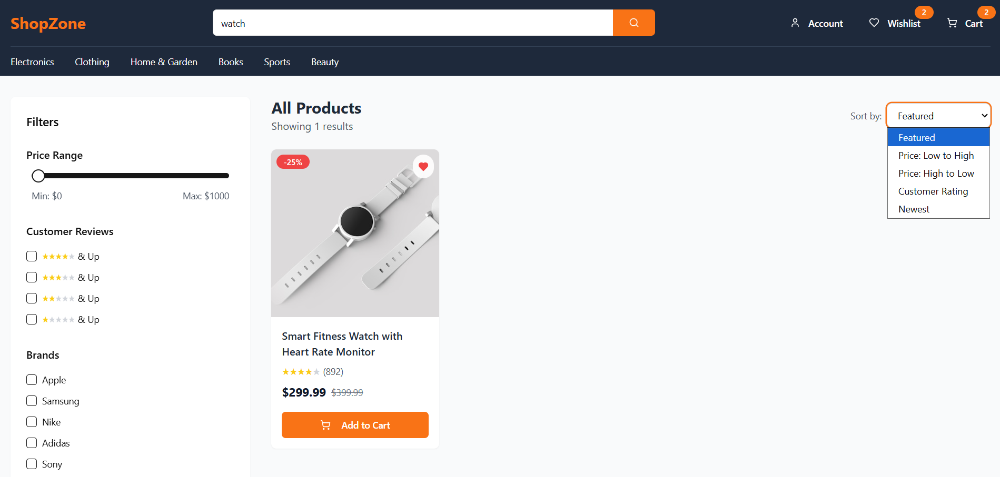
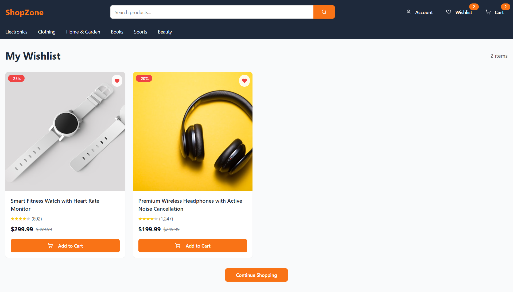
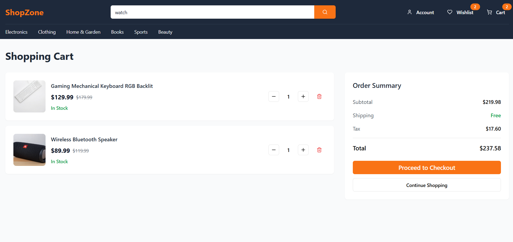
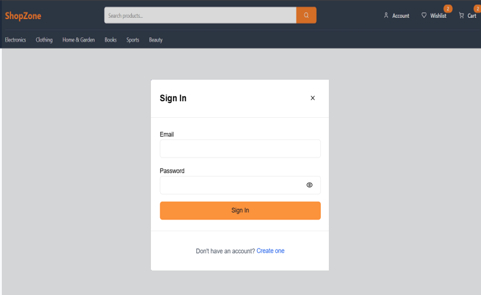

# 🛒 Amazon Clone – E-Commerce Website  

## 📖 Project Overview  
The **Amazon Clone** is a responsive e-commerce web application built to replicate the **core online shopping experience**.  
Developed with **HTML5, TailwindCSS, JavaScript and React**, it provides users with features like product search, wishlist, cart management and dynamic product listings.  
The platform is optimized for **performance, scalability and responsiveness**, ensuring a smooth shopping journey across devices.  


## 🎯 Goals  
- Deliver a **responsive e-commerce platform** with a seamless user experience.  
- Implement **core functionalities** of online shopping (cart, wishlist, product search).  
- Ensure a **real-time, scalable UI** for faster interactions.  
- Provide a **mobile-first design** with cross-browser compatibility.  
- Build a foundation for future **payment and order management integration**.  


## ✨ Features  
- 🛍️ **Dynamic Product Listings** – Browse products with real-time rendering.  
- 🛒 **Shopping Cart** – Add, remove, and update items in the cart.  
- ❤️ **Wishlist** – Save products for later purchase.  
- 🔍 **Search Functionality** – Quickly find products by name or category.  
- 📱 **Responsive Design** – Works seamlessly across desktop, tablet and mobile.  
- ⚡ **Fast Performance** – Optimized for smooth and scalable interactions.  


## 🛠️ Tech Stack  

| Category         | Tech Used                        |  
|------------------|----------------------------------|  
| Frontend         | HTML5, TailwindCSS, JavaScript, React |  
| State Management | React useState / useContext       |  
| Deployment       | Vercel                  |  


## 🚀 Installation & Setup  

1. Clone the repository:
   ```bash
   git clone https://github.com/Thamizhjaisankar-git/amazon-clone
   cd amazon-clone
3. Install dependencies:
   ```bash
   npm install

4. Run the development server:
   ```bash
   npm run dev

5. Open your browser and visit:
   ```bash
   http://localhost:5173


## 📊 Future Enhancements

- 💳 Integrated Payment Gateway (Stripe / Razorpay / UPI).
- 📦 Order Management System (track order history & status).
- 🔔 Push Notifications for offers and order updates.
- 🌍 Multi-language Support for global accessibility.
- 🧪 Testing Suite (unit, integration & UI tests with Jest/React Testing Library).


## 📸 Screenshots

<table width="100%">
  <tr>
    <td align="left" width="100%">
      
    </td>
</table>

<table width="100%">
  <tr>
    <td align="left" width="50%">
      
    </td>
    <td width="1%"></td> <!-- gap -->
    <td align="right" width="50%">
      
    </td>
  </tr>
</table>

<table width="100%">
  <tr>
    <td align="left" width="50%">
      
    </td>
    <td width="1%"></td> <!-- gap -->
    <td align="right" width="50%">
      
    </td>
  </tr>
</table>

<table width="100%">
  <tr>
    <td align="left" width="50%">
      
    </td>
    <td width="1%"></td> <!-- gap -->
    <td align="right" width="50%">
      
    </td>
  </tr>
</table>


## 👨‍💻 Author
- **Thamizh Jaisankar**
- 📧 [thamizhjaisankar@gmail.com](mailto:thamizhjaisankar@gmail.com)
- 🔗 [Portfolio](https://thamizh-jl.vercel.app/) | [GitHub](https://github.com/Thamizhjaisankar-git) | [LinkedIn](https://www.linkedin.com/in/thamizhjaisankar)

